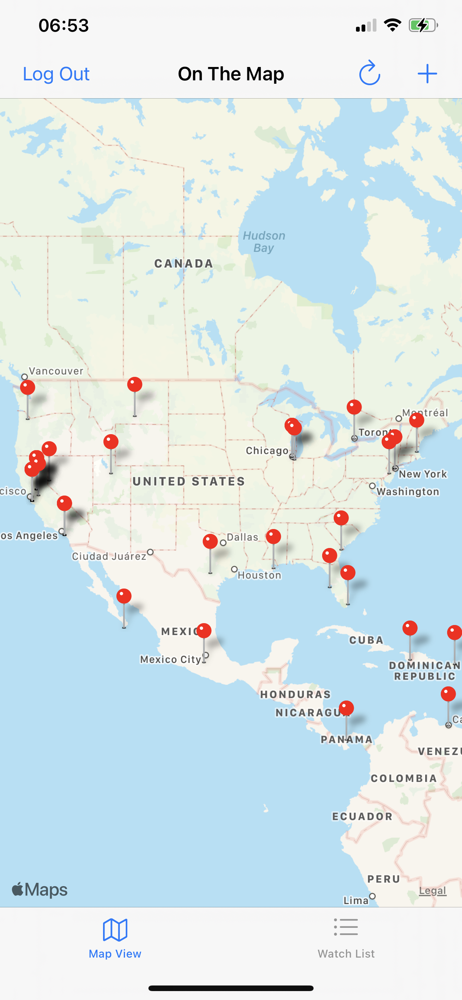
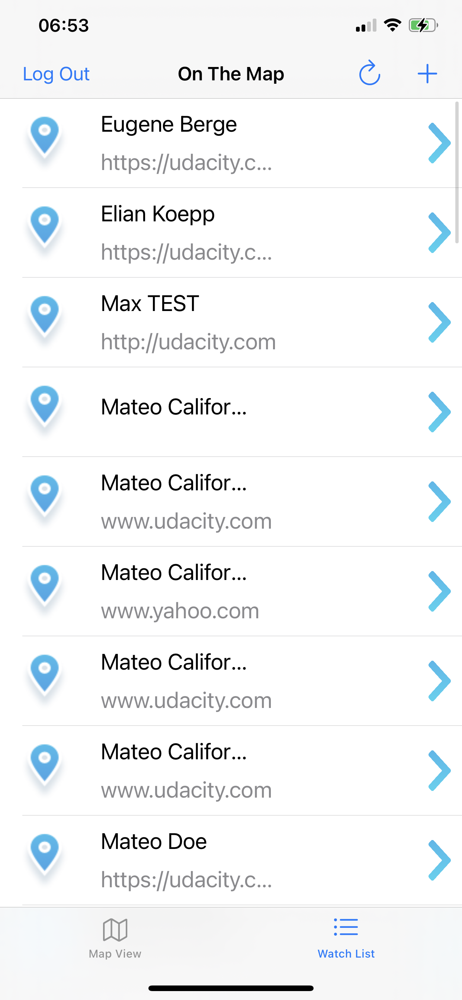
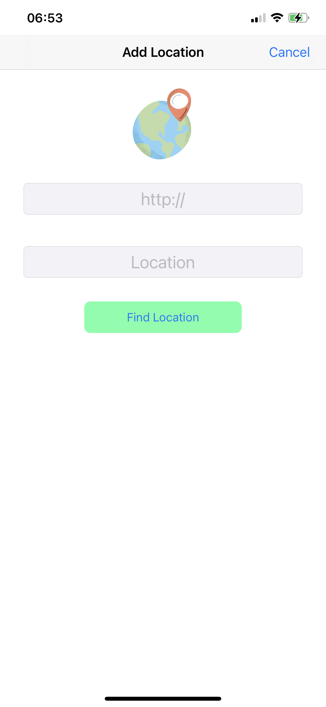

# OnTheMap
OnTheMap app, it's  a mobile app vith map integration, project as part of the UDACITY iOS Developer Nanodegree to practice getting data from and posting data to an API.

USER LOCATIONS

• Uses the Parse API to get a list of User Location objects
• Location objects are displayed in UITableViewController and MapViewController

SIGN IN

• The user can authenticate themselves using Udacity login credentials via the Udacity student API
. Once logged in, user is able post personal location to the Parse API

ADD LOCATION

• Users can post locations with an attached URL. These posts and locations are vesible to other users of the API.

OPE URLs

• Links attached to the user locations, can be opened in Safari by tapping on them.

# Images

           Loging                  MapView

  

           TableView
 
           AddPinLocationView

           LocationView

